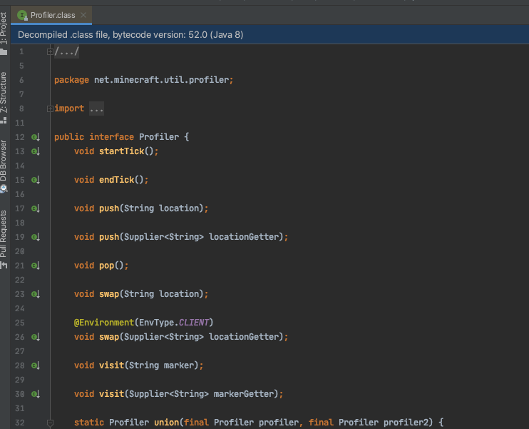
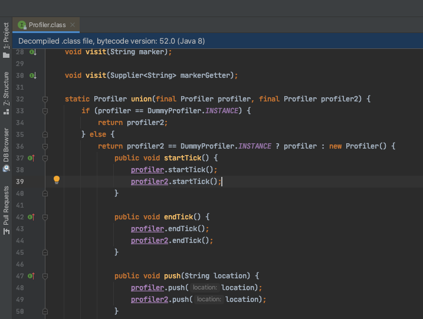
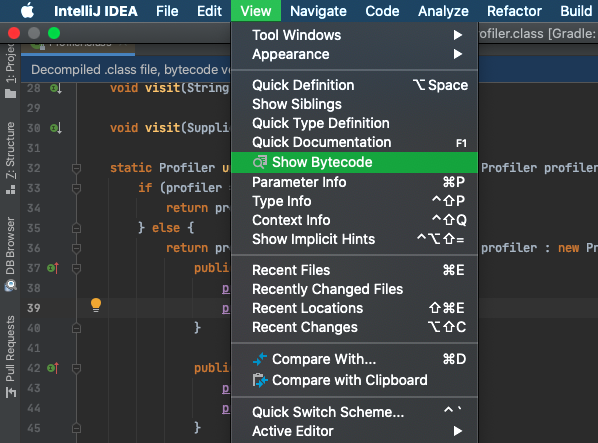
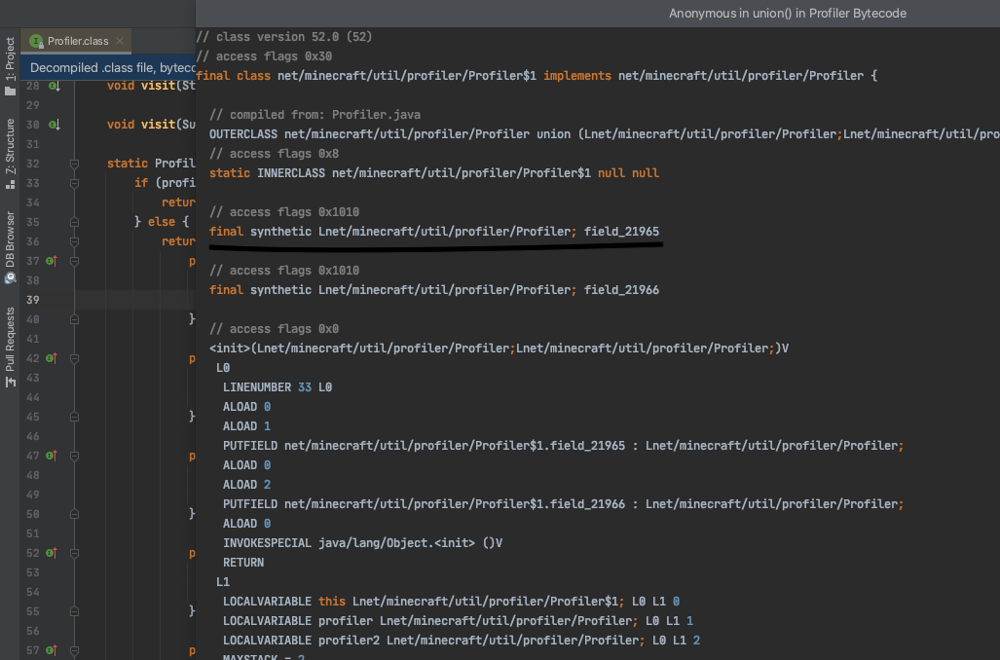

# `@Shadow`, anonymous class

[<- Return](README.md)

Allows accessing a 'local variable' used in an anonymous class, which is actually just a final instance field.

Shadowing the field is done the same way as a normal field, however finding the exact name of the field might be a bit tricky.

### IntelliJ Idea
- Open the class file



- Put your cursor on a line inside the anonymous class



- Click on View -> Show Bytecode



- Find the name of the field you need by index




### Eclipse
`TODO`


## `@Dynamic` Annotation
It might help IDE extensions such as [Minecraft Development](minecraftdev.org/) to know that the shadowed field is synthetic (compiler generated) to prevent unnecessary warnings. To do this, simply annotate the field with a `@Dynamic` annotation.

Example mixin:
```java
@Mixin(target="path/to/Dummy$1")
public abstract class MixinDummy_1 {
	@Dynamic
	@Final
	@Shadow
	private Profiler field_21965;
}
```
